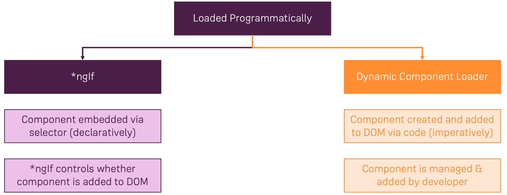

# Dynamic components

Dynamic components are essentially components which you create dynamically at runtime.

## Adding an alert modal component

```tsx
// alert.component.ts

@Component({
  selector: 'app-alert',
  templateUrl: './alert.component.html',
  styleUrls: ['./alert.component.css']
})
export class AlertComponent {
  @Input() message: string;
}
```

Add the template (and the CSS):

```html
<!-- alert.component.html -->

<div class="alert-box">
  <p>{{ message }}</p>
  <div class="alert-box-actions">
    <button class="btn btn-primary">Close</button>
  </div>
</div>
```

Add the component to `app.module.ts` and use it in the `auth.component.ts`:

```html
<app-alert [message]="error" *ngIf="error"></app-alert
```

## What are dynamic components?

Dynamic components in general just means that you want to display some component dynamically, which means it's not always there but it's there once something specific happens in your code.



## Using ngIf

Use `ngIf` whenever u can.

```tsx
// alert.component.ts

@Component({
  selector: 'app-alert',
  templateUrl: './alert.component.html',
  styleUrls: ['./alert.component.css']
})
export class AlertComponent {
  @Input() message: string;
	@Output() close = new EventEmitter<void>();

  onClose() {
    this.close.emit();
  }
}
```

```html
<!-- alert.component.html -->

<div class="backdrop" (click)="onClose()"></div>
<div class="alert-box">
  <p>{{ message }}</p>
  <div class="alert-box-actions">
    <button class="btn btn-primary" (click)="onClose()">Close</button>
  </div>
</div>
```

Add `onClose`:

```html
<!-- auth.component.html -->

<app-alert [message]="error" *ngIf="error" (close)="onHandleError()"></app-alert>
```

```tsx
// auth.component.ts

onHandleError() {
  this.error = null;
}
```

## Preparing programmatic creation

```tsx
// auth.component.ts
import { AlertComponent } from '../shared/alert/alert.component';
import { PlaceholderDirective } from '../shared/placeholder/placeholder.directive';

@ViewChild(PlaceholderDirective, { static: false }) alertHost: PlaceholderDirective;

private closeSub: Subscription;

// Inject component factory
constructor(
  private authService: AuthService,
  private router: Router,
  private componentFactoryResolver: ComponentFactoryResolver
) {}

private showErrorAlert(message: string) {
  const alertCmpFactory = this.componentFactoryResolver.resolveComponentFactory(
    AlertComponent
  );
  const hostViewContainerRef = this.alertHost.viewContainerRef;
	// Clear everything before rendering something new
  hostViewContainerRef.clear();

  const componentRef = hostViewContainerRef.createComponent(alertCmpFactory);

  componentRef.instance.message = message;
	// Close is an event emitter
  this.closeSub = componentRef.instance.close.subscribe(() => {
    this.closeSub.unsubscribe();
    hostViewContainerRef.clear();
  });
}

ngOnDestroy() {
    if (this.closeSub) {
      this.closeSub.unsubscribe();
    }
}
```

Add a placeholder directive and add it to `app.module.ts`:

```tsx
// placeholder.directive.ts

@Directive({
  selector: '[appPlaceholder]'
})
export class PlaceholderDirective {
  constructor(public viewContainerRef: ViewContainerRef) {}
}
```

Add `ng-template` to `auth.component.html`:

```html
<ng-template appPlaceholder></ng-template>
```

Add `AlertComponent` to `entryComponents` in `app.module.ts` if < **Angular 9**:

```tsx
// app.module.ts

entryComponents: [
  AlertComponent
]
```

Entry components are an array of components types, but only of components that will eventually need to be created without a selector or the route contact being used.